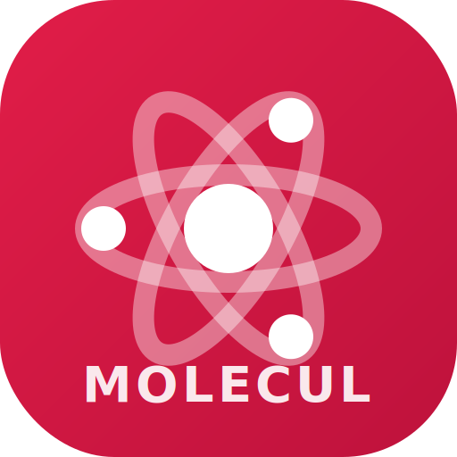
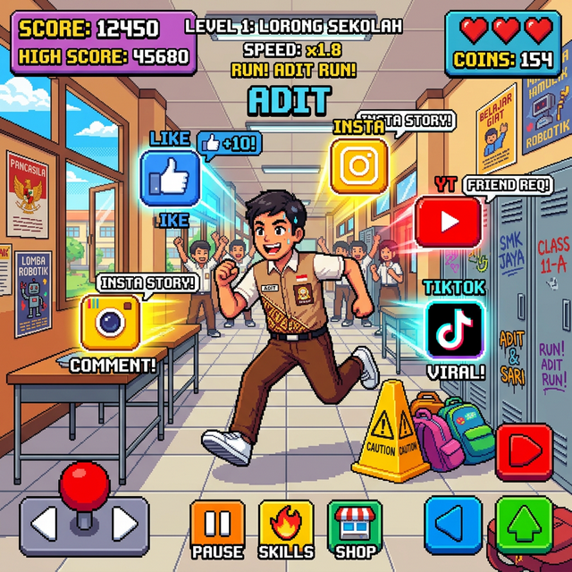
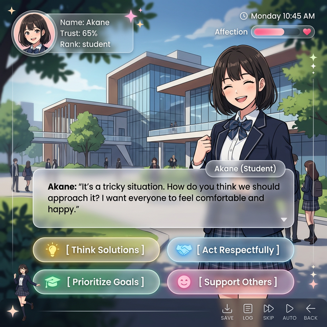
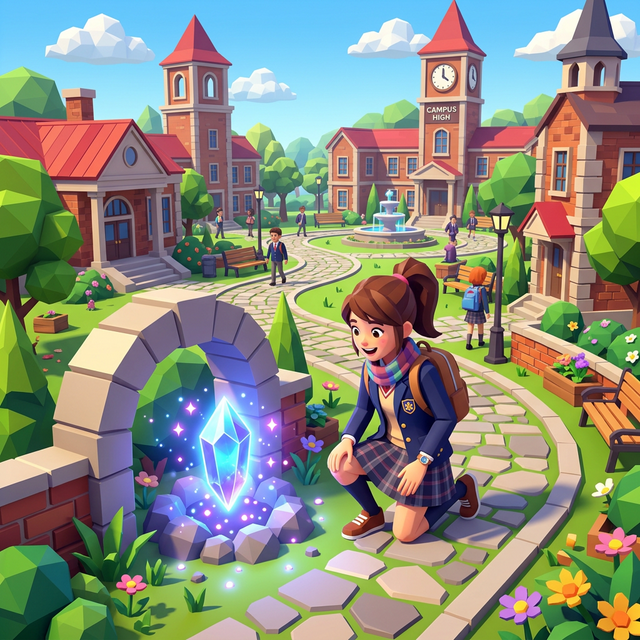

<p align="center">
  
</p>

<h1 align="center">🎮 MoLeCul — Moklet Learning Culture Journey</h1>

<p align="center">
  <b>Aplikasi Gamifikasi Pembelajaran Budaya Sekolah SMK Telkom Malang</b><br/>
  <i>Membangun karakter ATTITUDE melalui game interaktif, simulasi, dan AI</i>
</p>

<p align="center">
  
  
  
  
  
  
  
</p>

---

## 📋 Daftar Isi

- [Tentang Aplikasi](#-tentang-aplikasi)
- [Apa itu Moklet Learning Culture?](#-apa-itu-moklet-learning-culture)
- [Fitur Utama](#-fitur-utama)
- [Arsitektur Aplikasi](#-arsitektur-aplikasi)
- [Tech Stack](#-tech-stack)
- [Panduan Penggunaan](#-panduan-penggunaan)
- [Struktur Halaman](#-struktur-halaman)
- [Cara Menjalankan](#-cara-menjalankan)
- [Tim Pengembang](#-tim-pengembang)

---

## 🎯 Tentang Aplikasi

**MoLeCul** (Moklet Learning Culture) adalah aplikasi web progresif (PWA) yang dirancang untuk mengenalkan dan menginternalisasi **budaya belajar** di SMK Telkom Malang kepada siswa baru melalui pendekatan **gamifikasi**.

Aplikasi ini menjadi pendamping digital siswa selama **Masa Pengenalan Lingkungan Sekolah (MPLS)** dan seterusnya, mengubah proses pengenalan budaya sekolah yang biasanya satu arah menjadi pengalaman **interaktif, menyenangkan, dan bermakna**.

### 🎮 Kenapa Gamifikasi?

| Metode Tradisional | MoLeCul |
|---|---|
| Ceramah satu arah | Simulasi interaktif |
| Hafalan peraturan | Learning by doing |
| Evaluasi di akhir | Feedback instan |
| Motivasi eksternal | XP, badge, leaderboard |
| Selesai setelah MPLS | Journey berkelanjutan |

---

## 📖 Apa itu Moklet Learning Culture?

Moklet Learning Culture adalah kebiasaan bersama warga sekolah dalam belajar dan bekerja secara profesional. Bukan hanya menyelesaikan tugas, tapi **membangun mindset bertumbuh**.

### Nilai ATTITUDE

MoLeCul dibangun berdasarkan 8 nilai inti **ATTITUDE** SMK Telkom Malang:

| Huruf | Nilai | Deskripsi |
|:---:|---|---|
| **A** | Act Respectfully | Menjaga adab kepada guru & saling menghargai sesama |
| **T** | Talk Politely | Bertutur kata santun, positif, menghindari ucapan kasar |
| **T** | Turn Off Distraction | Fokus penuh pada materi, tidak bermain HP saat belajar |
| **I** | Involve Actively | Hadir sepenuhnya, merespon instruksi, aktif berpartisipasi |
| **T** | Think Solutions | Berorientasi pada penyelesaian masalah, bukan mengeluh |
| **U** | Use Tech Wisely | Memanfaatkan teknologi & AI sebagai alat bantu, bukan plagiasi |
| **D** | Dare to Ask | Membangun rasa ingin tahu, tidak malu bertanya |
| **E** | Eager to Collaborate | Terbuka untuk bekerja sama dan berbagi ilmu |

### 4 Pilar Praktik

1. 🛡️ **Character** — Disiplin, jujur, tanggung jawab, konsisten
2. 🤝 **Collaboration** — Bagi peran, komunikasi jelas, saling bantu
3. 📢 **Communication** — Berani bertanya, jelaskan ide dengan runtut
4. 🧠 **Critical Thinking** — Pakai data, cek fakta, cari akar masalah

---

## 🚀 Fitur Utama

### 1. 🏠 Dashboard Interaktif (Home)

Halaman utama yang menampilkan semua informasi dan akses cepat ke seluruh fitur.

**Komponen:**
- **Banner User** — Menampilkan profil, total XP, dan jumlah misi yang telah diselesaikan
- **Panel Aktivitas Harian** — Check-in harian, upload bukti kegiatan, dan refleksi diri
- **Streak & Progress** — Pelacakan konsistensi aktivitas harian
- **Quick Access Cards** — Akses cepat ke MoDy AI, Culture Hub, dan semua game
- **Leaderboard** — Peringkat Top 5 siswa berdasarkan total XP
- **Tech Radar** — Berita teknologi terkini (Cyber Security, DevOps, Cloud Computing) yang di-update secara berkala

---

### 2. 🗺️ Journey Map Sekolah

**Halaman:** `/journey`

Fitur unggulan berupa **peta petualangan interaktif** yang mensimulasikan satu hari penuh di sekolah. Siswa bergerak dari lokasi ke lokasi, menghadapi skenario nyata, dan membuat keputusan berbasis nilai ATTITUDE.

**5 Level yang harus ditempuh:**

| Level | Tema | Lokasi |
|:---:|---|---|
| 🌅 **Level 1** | Pagi Hari | Parkiran → Pos Satpam → Gerbang Sekolah |
| 📖 **Level 2** | Jam Pelajaran | Kelas → Kelas Lain → Ruang Guru → Ruang Piket |
| ☕ **Level 3** | Jam Istirahat | Kantin → Perpustakaan → UKS → Mushola |
| ⚽ **Level 4** | Kegiatan & Olahraga | Lab Komputer → Lap. Basket → Lap. Sepak Bola |
| 🏛️ **Level 5** | Organisasi & Pulang | Ruang OSIS → Kesiswaan → Tata Usaha |

**Cara Bermain:**
1. Pilih lokasi yang tersedia di peta
2. Baca skenario situasi yang disajikan
3. Pilih respons terbaik dari 3 opsi (best / good / bad)
4. Dapatkan feedback langsung dan skor ATTITUDE
5. Score akhir menentukan grade: S → A → B → C → D

**Contoh Skenario:**
> *"Di gerbang, kamu melihat adik kelas baru yang terlihat bingung dan ketakutan di hari pertamanya."*
> - ✅ Sapa dan tawarkan diri mengantarnya ke kelas (+3 Communication, +2 Respect)
> - ⚠️ Tunjukkan arah secara singkat (+1 Communication)
> - ❌ Jalan terus (-1 Respect, -1 Communication)

---

### 3. 🤖 MoDy — AI Moklet Buddy

**Halaman:** `/ai-tutor`

MoDy adalah asisten virtual berbasis **Google Gemini AI** yang di-prompt khusus (custom prompt engineering) agar bertindak sebagai kakak tingkat (senior) di SMK Telkom Malang yang suportif, asik, cerdas, dan selalu mendorong penerapan nilai **ATTITUDE**.

**Keunggulan & Karakter MoDy:**
- 🎭 **Persona Anak Moklet:** Menggunakan salam khas "Semangat Pagi!" dan gaya bahasa "Sam" / "Mbak" / "Rek" layaknya kakak tingkat (senior) asli SMK Telkom Malang.
- 🛡️ **Anti-Plagiasi (Socratic Method):** MoDy dirancang untuk tidak langsung memberikan jawaban tugas atau kode lengkap. MoDy memberikan *hint* (petunjuk), menanyakan kembali pemahaman siswa, dan membimbing siswa menemukan jawabannya sendiri (menstimulasi *Think Solutions*).
- 🧭 **Pengetahuan Spesifik Jurusan (TKJ & RPL):** MoDy bisa memberikan contoh logis yang disesuaikan dengan program keahlian siswa (misal: analogi routing untuk anak Teknik Komputer dan Jaringan, atau analogi algoritma untuk anak Rekayasa Perangkat Lunak).

**Fitur & Kemampuan Utama:**
- 📚 **Bimbingan Akademik & Kejuruan:** Membantu memahami konsep algoritma, jaringan dasar, matematika, hingga bahasa Inggris.
- 🏆 **Puspresnas & Mentoring Lomba:** Memberikan pedoman strategi memenangkan LKS (Lomba Kompetensi Siswa), OSN, atau FIKSI berdasarkan panduan terbaru.
- 💡 **Konselor Budaya ATTITUDE:** Menjawab kebingungan siswa tentang apa maksud nilai *Turn Off Distraction* saat praktek di lab, atau cara *Act Respectfully* kepada guru.
- 💻 **Mentor Coding & Troubleshooting:** Membantu men-debug error (menunjukkan error-nya dimana, bukan sekedar mengetikkan kode yang benar), dan praktik DevSecOps.
- 🔒 **Edukasi Cyber Security & Cloud Computing:** Menyediakan materi interaktif tentang praktik aman berinternet, hingga pemahaman dasar Cloud.

**Fitur Chat UI:**
- Typing animation real-time yang terasa natural.
- Formatting markdown (bold, italic, code blocks dengan syntax highlighting).
- History percakapan yang disimpan per sesi untuk melacak progress belajar.
- Topic chips untuk memulai obrolan dengan cepat (misal: "Bantu aku belajar JavaScript", "Apa itu Moklet Culture?").

---

### 4. 📖 Culture Hub

**Halaman:** `/culture`

Pusat pembelajaran lengkap tentang Moklet Learning Culture.

**Konten:**
- Penjelasan detail **Apa itu Moklet Learning Culture**
- **Kenapa penting untuk karier** — industri butuh sikap profesional
- **8 Nilai ATTITUDE** dengan deskripsi dan contoh konkret
- **4 Pilar Praktik** di Moklet
- **Checklist Harian ATTITUDE** — evaluasi diri setiap hari
- **Mapping Quest × Culture** — hubungan game dengan nilai budaya

---

### 5. 🎮 Training Grounds — Mini Games

Koleksi 10 mini-game edukatif interaktif yang dirancang untuk membangun _muscle memory_ dan kesadaran akan nilai-nilai ATTITUDE melalui pengalaman bermain yang seru. Setiap game dihubungkan dengan sistem XP dan leaderboard untuk menjaga retensi.

#### 🔴 Action Arena (Ketangkasan & Refleks)

<p align="center">
  
</p>

Mengasah kelincahan motorik, fokus, dan pengambilan keputusan cepat dalam menghindari hal negatif.

| Game | Deskripsi Detil & Mekanik | Nilai ATTITUDE yang Dilatih | Teknologi |
|---|---|---|---|
| 🏃 **Moklet Runner** | Endless runner tematik lingkungan sekolah SMK Telkom. Pemain berlari mengumpulkan "buku pelajaran" (poin) dan harus melompati/menghindari rintangan seperti "notifikasi sosmed" atau "kasur malas". Kecepatan bertambah seiring waktu. | **Turn Off Distraction**<br/>(Fokus pada tujuan) | Canvas 2D |
| 🥊 **Attitude Fighter** | Game arcade fighting 2D. Pemain berhadapan dengan monster yang merepresentasikan "Hoax", "Bullying", atau "Kemalasan". Meninju monster akan memancarkan kalimat positif untuk mengubah mereka menjadi energi baik. Terdapat combo bar (*Respect Meter*). | **Act Respectfully** & **Talk Politely** | React + SVG |
| 🚀 **Space Culture** | Game 3D space shooter _first-person_. Pemain mengendalikan pesawat dan menembak pesawat musuh/asteroid yang membawa label kebiasaan buruk ("Menyontek", "Terlambat"). Harus menembak akurat dan bertahan selama mungkin untuk skor tinggi. | **Think Solutions** & **Discipline** | Three.js + R3F |
| 🧩 **Moklet Tetris** | Puzzle falling block. Blok-blok yang jatuh bukan bentuk biasa, melainkan membawa kepingan prinsip ATTITUDE. Jika baris berhasil penuh, pemain mendapat "Culture Point" bonus untuk menyelesaikan kalimat ATTITUDE secara utuh. | **Eager to Collaborate**<br/>(Menyusun komponen jadi kesatuan) | React Canvas |

#### 🔵 Strategy Lab (Berpikir Kritis & Empati)

<p align="center">
  
</p>

Menguji cara berpikir jangka panjang, sebab-akibat, dan kebiasaan membuat keputusan dalam tekanan.

| Game | Deskripsi Detil & Mekanik | Nilai ATTITUDE yang Dilatih | Teknologi |
|---|---|---|---|
| 🔮 **Moklet Culture Simulation** | *Visual Novel / Decision-making game*. Berisi 10 chapter cerita kehidupan sekolah (dari MPLS, ujian, hingga magang Industri). Setiap pilihan dialog bercabang dan mempengaruhi stat: ATTITUDE, AKHLAK, BISA. Terdapat _multiple endings_. | **Keseluruhan 8 Nilai ATTITUDE** | React Interactive |
| 🏗️ **Arsitek Masa Depan** | Simulasi *Career Path* / *Resource Management* dari mulai masuk SMK hingga 5 tahun setelah lulus kuliah/kerja. Pemain harus membagi "Energi" dan "Waktu" harian untuk Belajar, Nongkrong, Berorganisasi, atau Istirahat. Pilihan yang seimbang menghasilkan _ending_ karir yang sukses. | **Think Solutions** & **Involve Actively** | React Interactive |
| ⚡ **Tantangan Kilat** | Mode kuis cepat (Speed Quiz). Sistem akan menampilkan skenario sosial (misal: "Temanmu sedang presentasi namun laptopnya mati mendadak"). Pemain hanya diberi waktu 5 detik untuk memilih tidakan paling tepat. | **Dare to Ask** & **Involve Actively** | React + Timer |
| 🔗 **Culture Connect** | *Tarik Garis / Matching Game*. Pemain menghubungkan blok konsep di sebelah kiri dengan pasangannya yang benar di kotak acak sebelah kanan menggunakan gestur *drag-and-drop*. Apabila cocok, balok berubah hijau dan menaikkan skor. Terdapat berbagai ronde untuk menghafal prinsip budaya dengan seru. | **Cognitve & Vocabulary Cerdas** | React + CSS SVG Lines |

#### 🟢 Exploration Zone (Petualangan 3D & Spasial)

<p align="center">
  
</p>

Mengeksplorasi lingkungan sekolah secara virtual untuk menumbuhkan rasa memiliki (sense of belonging) dan kesadaran lingkungan.

| Game | Deskripsi Detil & Mekanik | Nilai ATTITUDE yang Dilatih | Teknologi |
|---|---|---|---|
| 🗺️ **Journey Map** | Penjelasan detail ada pada poin "Journey Map Sekolah". Menghadirkan *top-down map* 2D. | **Involve Actively** & **Respect** | React Interactive |
| 💎 **Crystal Discovery** | *First-Person 3D Explorer*. Pemain berada di labirin atau halaman luas, bertugas mencari 8 Kristal yang tersembunyi. Tiap kristal melambangkan 1 huruf A-T-T-I-T-U-D-E. Saat ditemukan, kristal akan menembakkan pilar cahaya dan meng-unlock *lore* dari nilai tersebut. | **Use Tech Wisely** & **Involve Actively** | Three.js + OrbitControls |
| 🧱 **Integrity Tower** | Game fisika 3D menyusun balok menara (ala Jenga/Tower Bloxx). Balok melambangkan "Kejujuran", "Kerja Keras", dsb. Pemain harus menyusun setinggi mungkin. Jika fondasi nilai awal tidak kuat/miring, menara akan hancur lebur. | **Character** & **Think Solutions** | Three.js (Physics) |

---

### 6. 🏆 Puspresnas Arena

**Halaman:** `/events`

Portal informasi lengkap tentang **7 ajang talenta nasional** dari Puspresnas (Pusat Prestasi Nasional) yang bisa diikuti siswa.

| Ajang | Singkatan | Bidang | Jumlah Cabang |
|---|---|---|---|
| Lomba Kompetensi Siswa | **LKS SMK** | Vokasi & Keterampilan | 50+ bidang keahlian |
| Festival Inovasi & Kewirausahaan | **FIKSI** | Kewirausahaan | 22 cabang |
| Olimpiade Sains Nasional | **OSN** | Sains & Akademik | 9 bidang |
| Olimpiade Penelitian Siswa | **OPSI** | Penelitian Ilmiah | 15 bidang |
| Festival Lomba Seni Siswa | **FLS2N** | Seni & Budaya | 15 cabang |
| Olimpiade Olahraga Siswa | **O2SN** | Olahraga | 5 cabang |
| Lomba Debat Indonesia | **LDI** | Debat & Komunikasi | 2 bahasa |

Setiap ajang dilengkapi:
- Deskripsi detail
- Daftar cabang lomba lengkap dengan kategori
- Nilai karakter yang dikembangkan

---

### 7. 📡 Tech Radar

**Komponen:** Tertanam di halaman utama

Panel berita teknologi terkini yang berrotasi otomatis, mencakup 3 kategori utama jurusan SMK:

- 🛡️ **Cyber Security** — Ransomware, Zero-Trust Architecture
- 🚀 **DevOps** — CI/CD Pipelines, Platform Engineering
- ☁️ **Cloud Computing** — QaaS, Multi-Cloud Strategy

---

### 8. 🌤️ Weather Bar

**Komponen:** Sticky bar di bagian atas setiap halaman

Bar cuaca real-time yang menampilkan:
- 📍 Lokasi otomatis (GPS / IP-based / fallback Malang)
- 🌡️ Suhu saat ini
- ☀️ Kondisi cuaca

---

### 9. 📊 Sistem XP & Leaderboard

**Sistem Progres Terpadu:**
- Setiap game dan aktivitas memberikan **XP (Experience Points)**
- XP diakumulasi secara global di profil pengguna
- **Leaderboard** menampilkan peringkat antar siswa
- Misi yang diselesaikan tercatat dan bisa dilihat di dashboard

**Aktivitas yang memberikan XP:**
- ✅ Check-in harian
- 📝 Menulis refleksi
- 📸 Upload bukti kegiatan
- 🎮 Menyelesaikan game
- 🗺️ Menyelesaikan Journey Map
- 🔮 Menyelesaikan simulasi

---

### 10. 📱 Progressive Web App (PWA)

MoLeCul bisa di-**install** sebagai aplikasi di perangkat:

| Platform | Cara Install |
|---|---|
| **Android** | Buka di Chrome → Menu ⋮ → "Add to Home screen" |
| **iOS** | Buka di Safari → Share ↗️ → "Add to Home Screen" |
| **Desktop** | Buka di Chrome → Klik icon install di address bar |

Keuntungan PWA:
- 🔄 Buka langsung seperti native app
- 📱 Fullscreen tanpa browser bar
- 🎨 Icon di home screen
- ⚡ Loading cepat

---

## 🏗️ Arsitektur Aplikasi

```
MoLeCul Architecture
├── 🌐 Frontend (Next.js 16 + React 19)
│   ├── Server Components (Dashboard, Culture Hub)
│   ├── Client Components (Games, AI Chat)
│   └── Three.js (3D Games)
│
├── 🔑 Authentication (NextAuth + Google OAuth)
│   └── Login via akun Google
│
├── 💾 Database (Supabase / PostgreSQL)
│   ├── user_progress (XP, misi, skor)
│   └── scenarios (skenario simulasi)
│
├── 🤖 AI (Google Gemini API)
│   └── MoDy - AI Moklet Buddy
│
└── 📱 PWA (next-pwa)
    └── Installable web app
```

---

## 🛠️ Tech Stack

| Kategori | Teknologi |
|---|---|
| **Framework** | Next.js 16 (App Router) |
| **UI Library** | React 19 |
| **Language** | TypeScript 5 |
| **3D Engine** | Three.js + React Three Fiber |
| **Database** | Supabase (PostgreSQL) |
| **Auth** | NextAuth.js + Google OAuth 2.0 |
| **AI** | Google Gemini API |
| **PWA** | @ducanh2912/next-pwa |
| **Deployment** | Vercel |
| **Styling** | CSS Modules + Inline Styles |

---

## 📖 Panduan Penggunaan

### Untuk Siswa Baru (MPLS)

```
1. 📱 Buka link aplikasi MoLeCul di browser HP/laptop
2. 🔑 Login dengan akun Google (@smktelkom-mlg.sch.id)
3. 🏠 Kamu akan masuk ke Dashboard utama
4. 📋 Lakukan Check-in Harian di panel aktivitas
5. 🗺️ Mulai petualangan di Journey Map
6. 🎮 Mainkan mini-games di Training Grounds
7. 📖 Pelajari budaya di Culture Hub
8. 🤖 Tanya MoDy jika ada yang belum dipahami
9. 🏆 Cek posisimu di Leaderboard!
```

### Alur Harian yang Disarankan

```
Pagi    → Check-in + Journey Map
Siang   → Main game Action Arena / Strategy Lab
Sore    → Upload bukti kegiatan + Refleksi
Malam   → Chat dengan MoDy + Belajar di Culture Hub
```

---

## 📂 Struktur Halaman

```
/                     → Dashboard (Home)
/culture              → Culture Hub (Pengenalan Budaya)
/journey              → Journey Map Sekolah
/ai-tutor             → MoDy - AI Moklet Buddy
/events               → Puspresnas Arena
/events/[eventId]     → Detail Event + Cabang Lomba
/chapter/[id]         → Skill Tree Chapter (1-4)
/mission/[id]         → Halaman Misi Individual
├── /runner           → Moklet Runner (Endless Run)
├── /fighter-3d       → Attitude Fighter (Combat)
├── /space-shooter    → Space Culture (3D Shooter)
├── /tetris           → Moklet Tetris (Puzzle)
├── /simulation       → Culture Simulation (Decision)
├── /future           → Arsitek Masa Depan (Career Sim)
├── /challenge        → Tantangan Kilat (Speed Quiz)
├── /discovery-3d     → Crystal Discovery (3D Explore)
└── /integrity-3d     → Integrity Tower (3D Stack)
/auth/signin          → Login Page
/admin/logs           → Admin Panel (restricted)
```

---

## 💻 Cara Menjalankan (Development)

### Prerequisites
- Node.js 18+
- npm atau yarn

### Setup

```bash
# 1. Clone repository
git clone https://github.com/hadhiee/molecul-journey.git
cd molecul-journey

# 2. Install dependencies
npm install

# 3. Buat file .env.local
cp .env.example .env.local
# Isi variabel environment yang diperlukan:
# - NEXTAUTH_URL
# - NEXTAUTH_SECRET
# - GOOGLE_CLIENT_ID
# - GOOGLE_CLIENT_SECRET
# - NEXT_PUBLIC_SUPABASE_URL
# - NEXT_PUBLIC_SUPABASE_ANON_KEY
# - GEMINI_API_KEY

# 4. Jalankan development server
npm run dev

# 5. Buka di browser
# http://localhost:3000
```

### Environment Variables

| Variable | Deskripsi |
|---|---|
| `NEXTAUTH_URL` | URL aplikasi (localhost atau production) |
| `NEXTAUTH_SECRET` | Secret key untuk NextAuth |
| `GOOGLE_CLIENT_ID` | Google OAuth Client ID |
| `GOOGLE_CLIENT_SECRET` | Google OAuth Client Secret |
| `NEXT_PUBLIC_SUPABASE_URL` | URL project Supabase |
| `NEXT_PUBLIC_SUPABASE_ANON_KEY` | Supabase anonymous key |
| `GEMINI_API_KEY` | Google Gemini AI API Key |

---

## 🎓 Tim Pengembang

**MoLeCul** dikembangkan untuk mendukung program **Moklet Learning Culture** di SMK Telkom Malang.

---

<p align="center">
  <b>🎮 MoLeCul — Belajar Budaya, Seru Tanpa Batas!</b><br/>
  <i>SMK Telkom Malang © 2026</i>
</p>
